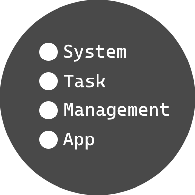
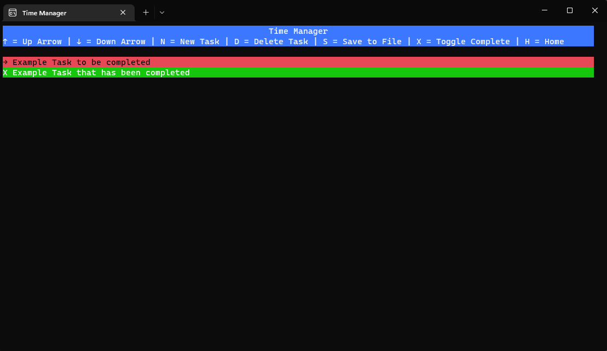

# Time Manager
This is quite a simple program, the basic structure is as follow

1. Application Starts
2. Attempts to load save data from the file
3. Gives the user the option to:
	A. Move up or down via arrow keys to change item selection
	B. Press N to create a new task
	C. Press D to delete a task
	D. Press S to save tasks to a file
	E. Press X to toggle the selected tasks completion state
4. If the task is complete, set the background green, if not then set to red

